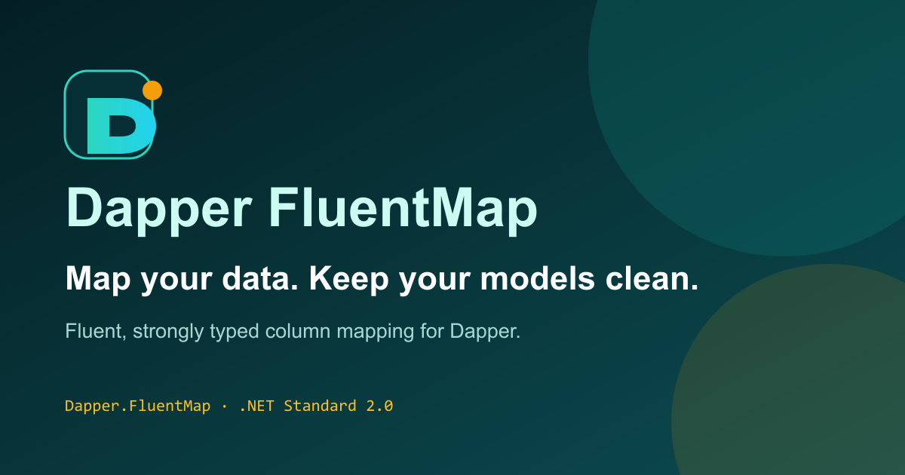

# FluentMap

<p align="center">
  
</p>

<p align="center"><strong>Map your data. Keep your models clean.</strong></p>

<p align="center">
  English · <a href="README.pt-BR.md">Português (Brasil)</a>
</p>

<p align="center">
  <a href="https://github.com/rodri-oliveira-dev/Dapper-FluentMap/actions/workflows/ci.yml"></a>
  <a href="https://www.nuget.org/packages/Dapper.FluentMap"></a>
  <a href="LICENSE"></a>
  <a href="https://github.com/rodri-oliveira-dev/Dapper-FluentMap/stargazers"></a>
</p>
<p align="center">
  <a href="https://github.com/rodri-oliveira-dev/Dapper-FluentMap/actions/workflows/codeql.yml"></a>
  <a href="https://sonarcloud.io/summary/new_code?id=rodri-oliveira-dev_Dapper-FluentMap"></a>
  <a href="https://sonarcloud.io/summary/new_code?id=rodri-oliveira-dev_Dapper-FluentMap"></a>
</p>

<p align="center">
  <a href="website/src/content/docs/getting-started/index.md">Getting Started</a> ·
  <a href="website/src/content/docs/index.mdx">Documentation</a> ·
  <a href="https://www.nuget.org/packages/Dapper.FluentMap">NuGet</a> ·
  <a href="website/src/content/docs/examples/index.md">Examples</a> ·
  <a href="https://github.com/rodri-oliveira-dev/Dapper-FluentMap/releases">GitHub Releases</a> ·
  <a href="#contributing">Contributing</a>
</p>

FluentMap provides fluent, strongly typed mappings for applications that use [Dapper](https://github.com/DapperLib/Dapper). It connects .NET properties to database columns without adding persistence attributes to domain entities.

FluentMap complements Dapper; it does not replace it and is not a full ORM. SQL, connections, transactions, migrations, and entity tracking remain outside its scope.

## Why FluentMap?

Imagine a .NET application with a `Customer` entity whose properties are `Id` and `Name`, while its database returns `customer_id` and `customer_name`. FluentMap keeps those physical column names in a dedicated, strongly typed map instead of coupling the entity to persistence details.

That gives you:

- cleaner domain models;
- strongly typed configuration;
- explicit, reusable mappings;
- direct integration with Dapper;
- support for reusable conventions;
- better organization of persistence code.

## Quick Start

Install the core package and, for this self-contained SQLite example, the database provider:

```bash
dotnet add package Dapper.FluentMap
dotnet add package Microsoft.Data.Sqlite
```

Define the entity and its map, register it once during startup, then query normally with Dapper:

```csharp
using Dapper;
using Dapper.FluentMap;
using Dapper.FluentMap.Mapping;
using Microsoft.Data.Sqlite;

FluentMapper.Initialize(config => config.AddMap<CustomerMap>());
FluentMapper.Validate();

using var connection = new SqliteConnection("Data Source=:memory:");
var customer = connection.QuerySingle<Customer>(
    "SELECT 7 AS customer_id, 'Ada' AS customer_name;");

public sealed class Customer
{
    public int Id { get; set; }
    public string Name { get; set; } = string.Empty;
}

public sealed class CustomerMap : EntityMap<Customer>
{
    public CustomerMap()
    {
        Map(customer => customer.Id).ToColumn("customer_id");
        Map(customer => customer.Name).ToColumn("customer_name");
    }
}
```

Initialize the global configuration before concurrent queries and treat it as read-only afterward. See the [Quick Start source](website/src/content/docs/getting-started/quick-start.md) if the planned portal is not yet deployed.

## Key Features

| Feature | Scope | Learn more |
| --- | --- | --- |
| Explicit property mapping | Core | [`EntityMap<T>` and property mapping](website/src/content/docs/concepts/property-mapping.md) |
| Naming conventions | Core | [Conventions](website/src/content/docs/concepts/mapping-conventions.md) |
| Immutable objects | Core | [Immutable objects](website/src/content/docs/advanced/immutable-objects.md) |
| Mapping profiles | Core | [Mapping profiles](website/src/content/docs/advanced/mapping-profiles.md) |
| Runtime isolation | Core | [`FluentMapRuntime`](website/src/content/docs/advanced/runtime-isolation.md) |
| Dependency Injection | Optional package | [DI integration](website/src/content/docs/integrations/dependency-injection.md) |
| Dommel integration | Optional package | [Dommel integration](website/src/content/docs/integrations/dommel.md) |
| Source generators | Optional package | [Source generators](website/src/content/docs/integrations/source-generators.md) |
| Roslyn analyzers | Optional package | [Roslyn analyzers](website/src/content/docs/integrations/roslyn-analyzers.md) |

The repository-local [usage guide](USAGE.md) remains available as a fallback for detailed API examples.

## Packages

| Package | Purpose |
| --- | --- |
| [`Dapper.FluentMap`](https://www.nuget.org/packages/Dapper.FluentMap) | Core mapping, conventions, profiles, materialization, and runtime APIs. |
| [`Dapper.FluentMap.Dommel`](https://www.nuget.org/packages/Dapper.FluentMap.Dommel) | Optional Dommel metadata and persistence integration. |
| [`FluentMap.DependencyInjection`](https://www.nuget.org/packages/FluentMap.DependencyInjection) | Registration of immutable configuration and isolated runtimes with Microsoft DI. |
| [`FluentMap.Analyzers`](https://www.nuget.org/packages/FluentMap.Analyzers) | Roslyn diagnostics for statically detectable mapping problems. |
| [`FluentMap.Generators`](https://www.nuget.org/packages/FluentMap.Generators) | Generated map registration and supported materializers. |

Package IDs are distribution identities. Assemblies, namespaces, and public APIs remain under `Dapper.FluentMap.*` where documented.

## Documentation

The bilingual documentation portal is planned for `https://rodri-oliveira-dev.github.io/Dapper-FluentMap/`. Until its deployment is confirmed, use the linked repository-local sources as fallbacks.

| Topic | Portal source | Repository guide |
| --- | --- | --- |
| Getting Started | [Start here](website/src/content/docs/getting-started/index.md) | [Quick Start](website/src/content/docs/getting-started/quick-start.md) |
| Basic Mapping | [Property mapping](website/src/content/docs/concepts/property-mapping.md) | [Usage guide](USAGE.md) |
| Advanced Mapping | [Advanced mapping](website/src/content/docs/advanced/index.md) | [Usage guide](USAGE.md) |
| Integrations | [Integrations](website/src/content/docs/integrations/index.md) | [Package overview](website/src/content/docs/reference/package-overview.md) |
| Examples | [Examples](website/src/content/docs/examples/index.md) | [SQLite example](website/src/content/docs/examples/sqlite.md) |
| Migration Guide | [Migration](website/src/content/docs/migration/index.md) | [MIGRATION.md](MIGRATION.md) |
| Compatibility | [Compatibility matrix](website/src/content/docs/reference/compatibility-matrix.md) | [COMPATIBILITY.md](COMPATIBILITY.md) |
| API Reference | [API overview](website/src/content/docs/reference/api-overview.md) | [Configuration reference](website/src/content/docs/reference/configuration-reference.md) |

## Project Status

FluentMap is actively maintained. The 3.x line preserves the main historical contracts—including `EntityMap<T>`, `FluentMapper.Initialize(...)`, and the Dapper type-map bridge—while newer capabilities remain opt-in. Review the [compatibility documentation](COMPATIBILITY.md) before upgrading.

For published versions and release history, see [GitHub Releases](https://github.com/rodri-oliveira-dev/Dapper-FluentMap/releases) and the [changelog](CHANGELOG.md).

## Contributing

Contributions are welcome. You can [report a bug or suggest an improvement](https://github.com/rodri-oliveira-dev/Dapper-FluentMap/issues/new/choose), help improve the [documentation](website/README.md), or submit a focused [pull request](https://github.com/rodri-oliveira-dev/Dapper-FluentMap/pulls).

If FluentMap helps your project, consider giving the repository a [GitHub star](https://github.com/rodri-oliveira-dev/Dapper-FluentMap/stargazers).

## License

FluentMap is licensed under the [MIT License](LICENSE).
